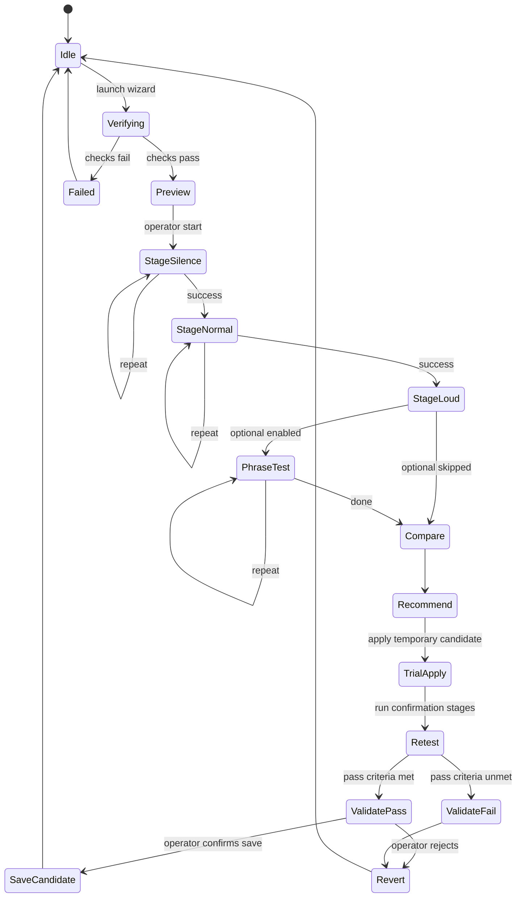
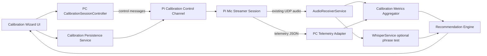

# Architecture Review

## Metadata

- **Title:** AUDIO-001 Interactive Microphone Calibration Wizard Architecture Review
- **Purpose:** Define a repeatable, operator-guided calibration wizard integrated into the existing PC Tkinter app, using the real Pi audio pipeline with safe temporary trials and rollback.
- **Date:** 2026-06-27
- **Author / Agent:** System Architect (AI assistant using Copilot CLI runtime in VS Code)
- **Source Prompt:** System Architect request for interactive microphone calibration interface and architecture decisions (2026-06-27).
- **Related Documents:**
  - `docs/AI Engineering Framework/project_state.json`
  - `docs/AI Engineering Framework/Development_Lifecycle.md`
  - `docs/AI Engineering Framework/Agent_Orchestration_Guide.md`
  - `docs/AI Engineering Framework/Prompt_Standards.md`
  - `docs/AI Engineering Framework/Report_Standards.md`
  - `docs/AI Engineering Framework/Documentation_Standards.md`
  - `docs/Agent Docs/diagnostics/audio_001_mic_agc_calibration_diagnostic_2026-06-27.md`
  - `docs/Agent Docs/diagnostics/audio_001_live_room_followup_validation_2026-06-27.md`
  - `docs/prompts/agents/Stable Commit Cleanup/System_Architecture_and_Interface_Control_Document.md`
- **Related Implementation:**
  - `pc/operator_console_app.py`
  - `pc/runtime_config.py`
  - `pc/services/audio_receiver.py`
  - `pc/services/whisper_service.py`
  - `pc/services/pi_streamer_manager.py`
  - `pi/mic_udp_streamer.py`
  - `pi/audio/streamer.py`
  - `pi/audio/signal_processing.py`
  - `pi/audio/config.py`
  - `pi/audio/protocol.py`
- **Related Validation:** See both AUDIO-001 diagnostic reports dated 2026-06-27.
- **Assumptions:**
  - Existing PC/Pi deployment topology remains unchanged.
  - Calibration is initiated by an operator in the Tkinter app while the Pi is reachable over SSH.
  - Existing UDP audio path remains the authoritative capture/transcription path.

## Review Scope

This review covers architecture only (no production implementation changes) for a new **Calibration Wizard** that:

1. Runs in the existing PC Tkinter app.
2. Uses the existing Pi mic streamer and PC audio receiver/transcription stack.
3. Guides repeatable silence / normal / loud measurements with explicit timing cues.
4. Supports temporary parameter trials, comparison to baseline, validation, apply/retest/revert/save.
5. Adds a hardware-quality assessment gate before declaring microphone defects.

Out of scope:

- Direct production code edits in this task.
- Permanent calibration value changes in this task.
- Any parallel/competing audio capture pipeline.

## Current Architecture

- PC owns GUI orchestration (`OperatorConsoleApp`) and speech segmentation/transcription (`AudioReceiverService` + `WhisperService`).
- Pi mic processing is in `UDPMicStreamer` (`pi/audio/streamer.py`) using `select_mono_channel()` and `apply_agc_and_gate()`.
- Audio transport is UDP with `AUDIO_HEADER = !IH` followed by int16 PCM payload.
- Pi process lifecycle is controlled from PC via SSH (`PiStreamerManager`).
- Existing diagnostics evidence confirms:
  - Gate/AGC interplay can over-gate or over-amplify depending on values.
  - Transcript fidelity can fail even with non-clipping signal.
  - Multiple contributors are plausible (capture SNR, gate/AGC tuning, PC segmentation, environment).

## Findings

### Verified facts (from evidence and implementation)

1. Operator-timed conversational calibration is not repeatable enough for reliable stage capture.
2. Current UI has RMS and threshold controls but no guided stage timer/state machine.
3. Current transport does not expose runtime gate/AGC/speech-state telemetry to UI.
4. Live follow-up showed heavy gating during speech and poor transcript fidelity; no clipping-dominant failure.
5. No evidence proves microphone hardware is defective yet.

### Proposed user workflow (wizard)

1. **Device and connection verification**
2. **Microphone input preview**
3. **Silence measurement**
4. **Normal speech measurement (~2 ft)**
5. **Loud speech measurement**
6. **Optional phrase transcription test**
7. **Results comparison (baseline vs candidate vs current)**
8. **Recommended settings**
9. **Apply / Retest / Revert / Save**

Each stage must include:

- clear visual state
- written instructions
- visible countdown
- explicit start/stop cues
- progress indicator
- repeat-stage action
- capture-success confirmation

### Proposed GUI layout

- **New top-level tab:** `Calibration Wizard`
- **Left panel (operator-facing):**
  - Stage card (instruction text, status, countdown, start/stop cue)
  - Progress bar + stage index
  - Primary actions (Start Stage, Repeat Stage, Next)
  - Apply / Retest / Revert / Save controls
- **Right panel (summary):**
  - Per-stage capture health badges
  - Baseline vs candidate vs validated comparison table
  - Recommendation panel with confidence and reasons
- **Collapsible advanced diagnostics drawer (hidden by default):**
  - raw RMS, processed RMS, peak, clipping
  - noise-gate state ratio
  - AGC gain stats
  - speech-detection state
  - UDP continuity (seq gaps, jitter spike counter)
  - recent-level history waveform
  - current transcription output (optional stage)

### Wizard state machine

## Risks

1. **UI overload risk:** showing all telemetry at once can confuse operators.
2. **Cross-thread UI risk:** Tkinter updates from non-UI threads must stay queue-based.
3. **Temporary-setting leakage risk:** test values could accidentally persist as production.
4. **Race/conflict risk:** calibration may collide with active streamer/listening controls.
5. **Protocol-coupling risk:** extending audio packet payload can break current receiver if not versioned.
6. **False hardware-defect risk:** poor environment/config could be misclassified as mic failure.

## Recommendations

### 1) PC vs Pi responsibility split

- **PC (primary orchestration):**
  - Wizard UI/state machine, countdowns, cues, stage control.
  - Trial scheduling, result scoring, baseline/candidate comparison.
  - Transcription quality checks and segmentation impact analysis.
  - Safety controls (apply/retest/revert/save).
- **Pi (real-time signal authority):**
  - Apply test parameters in-memory.
  - Emit per-window metrics tied to exact audio sequence ranges.
  - Keep using existing live capture + AGC/gate + UDP audio path.

### 2) Runtime metrics Pi must expose

- `raw_rms_{p50,p90,mean}`
- `proc_rms_{p50,p90,mean}`
- `peak_max`
- `clip_ratio`
- `gate_active_ratio`
- `agc_gain_{min,p50,max}`
- `active_channel`
- `speech_flag_ratio` (if speech activity is computed Pi-side)
- `seq_start`, `seq_end`, `chunks_captured`, `chunks_dropped`
- stage/session identifiers and timestamps

### 3) Protocol strategy

- **Do not alter existing audio UDP payload format for calibration.**
- Add a **separate low-rate diagnostics control channel** (JSON messages) for calibration telemetry and commands.
- Telemetry messages include `seq_start/seq_end` so PC aligns metrics to corresponding audio chunks already received over existing UDP.

### 4) Temporary-setting safety

- Create a **Calibration Session** with:
  - immutable baseline snapshot (current production values)
  - mutable trial profile (test candidate values)
- Trial values apply **only in memory** on Pi during active session.
- Save action is disabled until retest pass criteria are met.

### 5) Rollback design

- Automatic rollback to baseline on:
  - Cancel
  - Stage failure
  - Telemetry/control channel loss
  - Validation fail
- Explicit `Revert` action always available.
- End-of-session guard verifies Pi effective values equal baseline unless explicit Save completed.

### 6) Configuration persistence design

- Distinguish:
  - **Measured values** (stage captures/artifacts)
  - **Experimental candidates** (trial-only)
  - **Validated production values** (persisted)
- Persist only validated values after operator confirm into a single production configuration source (recommended: env-backed settings consumed by `pi/audio/config.py` and PC runtime thresholds).
- Save operation should be transactional:
  1. write pending values
  2. restart/reload streamer
  3. run short verification capture
  4. finalize or auto-rollback

### 7) Conflict avoidance with active runtime

- Add calibration exclusive lock in PC app:
  - blocks Streamers-tab start/stop actions while calibration active
  - pauses normal listening/inference-driven operations that could interfere with scoring
- Reuse existing receiver path; do not spawn a second audio ingest path.
- Calibration mode is a controlled mode of existing runtime, not a parallel pipeline.

### 8) Existing modules to reuse

- `OperatorConsoleApp` (new tab + control integration)
- `RuntimeConfig` (temporary PC segmentation candidates)
- `AudioReceiverService` (audio ingress and RMS feed)
- `WhisperService` (optional phrase test + transcript output)
- `PiStreamerManager` (session lifecycle and Pi command channel bootstrap)
- `UDPMicStreamer` / `apply_agc_and_gate` / `select_mono_channel` (actual measured signal path)

### 9) Proposed new modules/interfaces

- **PC-side**
  - `pc/services/calibration_session_controller.py`
  - `pc/services/calibration_metrics_aggregator.py`
  - `pc/services/calibration_recommendation_engine.py`
  - `pc/services/calibration_persistence_service.py`
  - `pc/gui/calibration_wizard_panel.py`
  - `pc/gui/calibration_diagnostics_drawer.py`
- **Pi-side**
  - `pi/audio/calibration_control.py` (temporary parameter apply/reset)
  - `pi/audio/calibration_telemetry.py` (windowed metric emission with seq linkage)
  - `pi/audio/calibration_session.py` (stage lifecycle and resets)

### 10) Controlled parameter trials

- Baseline run first (current production values).
- Candidate sweeps for:
  - `NOISE_GATE_RMS`
  - `TARGET_RMS`
  - `MAX_GAIN`
  - `AGC_ATTACK`
  - `AGC_RELEASE`
  - PC `volume_threshold`
  - `silence_timeout` (when phrase quality requires)
- Score with weighted criteria:
  - speech-vs-silence separation margin
  - gate-during-speech penalty
  - clipping penalty
  - transcript fidelity gain
  - UDP continuity stability

### 11) Failure handling

- Stage timeout -> mark failed, offer repeat, preserve prior stage data.
- Missing data window -> no recommendation update; retry required.
- Pi control disconnect -> immediate rollback + session abort.
- UDP continuity breach threshold -> candidate invalid.
- Transcription model instability -> annotate as model-limited; do not auto-fail hardware.

### 12) Hardware-quality assessment criteria

The wizard should classify likely cause using measurable gates:

- **Low mic signal likely** if raw speech RMS remains near silence across repeated normal/loud stages.
- **Environmental noise likely** if silence floor is high/variable and gate cannot suppress without harming speech.
- **Orientation issue likely** if loud stage gain improves significantly only with reposition guidance.
- **Dead/inactive channel likely** if one channel stays near-zero while the other carries signal inconsistently.
- **Invalid channel config likely** if `left/right/mix/auto` materially changes speech detectability.
- **Stream init instability likely** if startup windows show non-repeatable raw/processed metrics.
- **Gate/AGC issue likely** if raw speech exists but processed speech is heavily gated or compressed.
- **PC segmentation issue likely** if Pi processed metrics improve but phrase segmentation/transcripts remain poor.
- **Transcript model behavior likely** if audio metrics pass quality thresholds but phrase fidelity remains low.

Microphone hardware is **not** classified defective unless repeated controlled runs show unacceptable SNR/capture quality after configuration and environment controls are exhausted.

### Data and control flow (proposed)

### Implementation phases

1. **Phase A: UX shell + state machine**
   - Wizard screens, countdown cues, stage transitions, repeat controls.
2. **Phase B: Telemetry/control channel + synchronized capture**
   - Pi per-window metrics with seq alignment; PC aggregator.
3. **Phase C: Trial engine + baseline/candidate comparison**
   - Temporary apply/retest/revert safety.
4. **Phase D: Persistence + transactional save verification**
   - Promote only validated production values.
5. **Phase E: Hardware assessment + operator guidance**
   - Cause classification and corrective instructions.
6. **Phase F: End-to-end live-room validation and release gate**
   - Production acceptance tests.

### Validation requirements before production use

- Deterministic stage timing and capture boundaries across repeated runs.
- Verified seq-alignment between Pi telemetry windows and PC audio chunks.
- Proven rollback on cancel/failure/disconnect.
- Candidate application never persists without explicit save and pass gate.
- Live-room validation demonstrates improved transcript fidelity and reduced speech gating.
- Regression check: existing connect/listen/streamer workflows unchanged when wizard not used.

## Approved Changes

Approved for implementation planning:

1. Add a calibration wizard tab to existing Tkinter app (no separate app).
2. Add a separate diagnostics control channel for calibration telemetry/commands.
3. Keep existing UDP audio packet format and ingestion pipeline unchanged.
4. Add temporary-session calibration apply/retest/revert/save workflow with strict rollback guarantees.
5. Add hardware-assessment classifier based on measurable evidence thresholds.

Not approved in this architecture phase:

- Production config value promotion without controlled validation.
- Declaring microphone hardware defective without controlled elimination of config/environment factors.

## Recommended Next Agent

**Runtime Implementation Agent**

## Recommended Next Objective

Implement Phase A and Phase B of this architecture: build the PC calibration wizard state machine/UI scaffolding plus Pi/PC calibration control+telemetry plumbing with synchronized stage capture and mandatory rollback safety, then hand off for targeted validation.
