# System Architecture and Interface Control Document (SAICD)

## Document Metadata

- **Title:** System Architecture and Interface Control Document (SAICD)
- **Purpose:** Define the current PiBot runtime architecture, interfaces, module responsibilities, and integration behavior.
- **Last Updated:** 2026-06-26
- **Source Prompt:** User request: "update all files in /docs/ to be compliant with the attached file"
- **Source Documents Used:** `docs/json/prompt_header.json`, `docs/Prompt_Header.md`, `docs/json/system_manifest.json`
- **Source Implementation Analyzed:** `docs/`
- **Related Documents:** `docs/json/prompt_header.json`, `docs/Prompt_Header.md`, `docs/json/system_manifest.json`, `docs/System_Diagnostic_and_Troubleshooting_Guide.md`
- **Assumptions:** Compliance is satisfied by including the required fields defined in `docs/json/prompt_header.json` under `documentation_generation_rules.required_fields`.
- **Revision History:**
  - 2026-06-26: Added Prompt Header compliance metadata block.

This document describes the repository as it exists now. Where implementation differs from prior audit notes or apparent intent, the implementation below is the source of truth.

## 1. Executive Summary

PiBot is a two-host voice and vision system:

- **PC runtime**: Tkinter operator console, UDP audio/video receivers, Whisper transcription, Ollama text generation, and YOLO inference overlay.
- **Pi runtime**: UDP microphone streamer, UDP camera streamer, and a microphone diagnostics utility.

The current architecture is:

1. The **Pi** streams microphone PCM over UDP port **5001** and video JPEG chunks plus heartbeat packets over UDP port **5000**.
2. The **PC** binds those UDP ports, reassembles video frames, optionally runs YOLO inference, buffers audio, segments speech with Whisper, and forwards final transcripts to Ollama.
3. The **PC GUI** is the primary control plane for connect/disconnect, listening, inference, streamer start/stop over SSH, and live status reporting.
4. Configuration is loaded from `pibot.env` or `PIBOT_CONFIG_FILE`, with environment variables overriding file values.

Major capabilities currently implemented:

- live video preview with optional YOLO overlay
- UDP microphone ingestion and Whisper speech recognition
- Ollama streaming response display
- SSH control of Pi-side streamer processes
- heartbeat-based video liveness tracking
- runtime audio/listening toggles

## 2. Repository Layout

### Root layout

```text
/home/jorg/pibot
  - .editorconfig
  - pibot_config.py
  - pibot.env
  - requirements.txt
  - yolo26m.pt
  - archives/
  - pc/
  - pi/
  - tests/
  - .vscode/
  - .run/
  - docs/
```

### Major directory purposes

| Directory | Purpose |
|---|---|
| `pc/` | Current PC-side application code. |
| `pi/` | Current Raspberry Pi-side streamer and diagnostic code. |
| `archives/` | Historical compatibility shims and older modules not used by the current runtime. |
| `tests/` | Unit and end-to-end tests for Whisper and Ollama flow. |
| `.vscode/` | VS Code workspace settings and SFTP deployment config. |
| `.run/` | Runtime PID/log location used by Pi streamer startup scripts and SSH status checks. |
| `docs/` | Generated architecture documentation, including this SAICD and the machine-readable manifest. |

### Shallow tree of significant source files

```text
pc/
  client.py
  operator_console_app.py
  runtime_config.py
  logging_utils.py
  services/
    audio_receiver.py
    ollama_service.py
    pi_streamer_manager.py
    prompt_submission.py
    startup_checks.py
    thread_monitor.py
    whisper_service.py
  video/
    frame_buffer.py
    inference_engine.py
    protocol.py
    receiver_widget.py

pi/
  mic_udp_streamer.py
  video_udp_streamer.py
  audio_diagnostics.py
  audio/
    config.py
    device_selection.py
    protocol.py
    signal_processing.py
    streamer.py
  video/
    config.py
    frame_source.py
    protocol.py
    streamer.py

archives/
  pc/
    mic_udp_receiver.py
    mic_udp_reciever.py
    video_udp_receiver.py
    video_udp_reciever.py
    yolo_packet.py
```

## 3. Software Architecture

### PC application

`pc/client.py` is the PC composition root. It loads settings, creates `OperatorConsoleApp`, and starts the Tkinter main loop.

`OperatorConsoleApp` builds the entire GUI and owns the runtime services:

- `AudioReceiverService` for UDP audio ingress
- `WhisperService` for speech segmentation and transcription
- `OllamaService` for streamed LLM responses
- `UDPVideoReceiver` for video receive/decode/render/inference
- `PiStreamerManager` for SSH control of Pi streamer processes
- `StartupChecks` for model/UDP/Ollama validation

### Pi application

The Pi side is split into two standalone scripts:

- `pi/mic_udp_streamer.py`
- `pi/video_udp_streamer.py`

Each script loads settings, writes a PID file under `.run/`, constructs its streamer object, and runs forever until interrupted or signaled.

### Communication layer

- **Audio**: UDP datagrams with `AUDIO_HEADER = struct.Struct("!IH")` followed by 16-bit PCM.
- **Video**: UDP datagrams with `CHUNK_HEADER = struct.Struct("!IHH")` followed by JPEG chunks.
- **Heartbeat**: UDP datagrams with `HEARTBEAT_PACKET = struct.Struct("!BQ")`.
- **Remote control**: SSH commands from PC to Pi for streamer start/stop/status.
- **LLM**: HTTP POST streaming to Ollama `/api/generate`.

### UI layer

The Tkinter UI contains:

- connection/startup bar
- Whisper control tab
- inference tab
- streamer control tab
- audio tab
- logs tab
- live video preview area
- bottom status bar

### Streaming layer

- Pi audio streamer captures microphone input, selects a mono channel, applies AGC + gate, and sends PCM packets.
- Pi video streamer captures camera or synthetic frames, JPEG encodes them, chunks them, and sends chunks plus heartbeat packets.
- PC audio receiver downsamples audio to Whisper rate and queues chunks.
- PC video receiver reassembles JPEG frames, decodes them, and optionally overlays YOLO detections.

### Inference layer

- `InferenceEngine` lazily loads `ultralytics.YOLO` and runs `track(frame, verbose=False)`.
- `WhisperService` lazily loads `whisper.load_model("base")` and transcribes speech phrases.
- `OllamaService` streams generated text back into the GUI.

### Speech layer

Speech processing is fully on the PC:

1. audio packets enter `AudioReceiverService`
2. resampled chunks land in `audio_queue`
3. `WhisperService` detects phrase boundaries using RMS threshold + silence timeout
4. final transcripts are pushed to `ollama_queue`
5. `OllamaService` streams the model response into the GUI

### Configuration layer

`pibot_config.load_settings()` merges:

1. process environment
2. optional `PIBOT_CONFIG_FILE`
3. `pibot.env`
4. hardcoded defaults

### Logging layer

`OperatorConsoleApp` creates:

- a stream logger to stdout
- `GuiLogHandler` that enqueues formatted log lines into the GUI log queue

### Utilities

- `RuntimeConfig` holds thread-safe audio/listening toggles.
- `ThreadMonitor` exists but is not currently wired into `OperatorConsoleApp`.
- `StartupChecks` validates deploy/runtime readiness.

## 4. Module Inventory

### Current runtime modules

| File | Purpose | Public API | Dependencies | Called by | Calls into | Config / runtime responsibilities |
|---|---|---|---|---|---|---|
| `pibot_config.py` | Central configuration loader. | `AppSettings`, `load_settings()` | `os`, `Path` | PC and Pi entrypoints, archived shims | env vars, env-file parser | Loads UDP ports, hosts, rates, model path, Ollama URL/model, Pi SSH settings. |
| `pc/client.py` | PC startup root. | `create_application()`, `main()` | `tkinter`, `pibot_config`, `OperatorConsoleApp` | User launch | GUI app creation | App bootstrap and Tk main loop. |
| `pc/runtime_config.py` | Thread-safe runtime toggles. | `RuntimeConfig` | `threading` | GUI controls, Whisper worker | internal lock | Controls audio stream enabled, listening enabled, threshold, silence timeout. |
| `pc/logging_utils.py` | GUI log bridge. | `GuiLogHandler.emit()` | `logging`, `queue` | `OperatorConsoleApp` | queue | Redirects formatted log messages to GUI queue. |
| `pc/operator_console_app.py` | Main GUI and orchestration. | `OperatorConsoleApp` methods listed in code | Tkinter, services, video widget | `pc/client.py` | services, widgets | Owns UI state, queues, worker lifecycle, status bar, SSH controls, audio/listening/inference controls. |
| `pc/services/audio_receiver.py` | UDP audio ingest. | `AudioReceiverService.run()`, `close_socket()` | `numpy`, `scipy.signal.resample_poly`, sockets | `OperatorConsoleApp.connect()` | `RuntimeConfig`, audio queue | Receives UDP audio, computes RMS, downsamples 48 kHz to 16 kHz, drops oldest chunk on queue full. |
| `pc/services/whisper_service.py` | Speech segmentation and transcription. | `WhisperService.run()` | `whisper`, `numpy`, queues | `OperatorConsoleApp.connect()` | `PromptSubmission`, Whisper model | Loads Whisper base model lazily, detects phrases, emits partial/final transcripts, enqueues prompts. |
| `pc/services/ollama_service.py` | Streamed LLM worker. | `OllamaService.run()` | `requests`, `json`, queues | `OperatorConsoleApp.connect()` | Ollama HTTP API, GUI callbacks | Sends prompt to `/api/generate`, streams token responses into GUI. |
| `pc/services/pi_streamer_manager.py` | SSH control of Pi processes. | `query_status()`, `run_action()` | `subprocess`, `threading`, `ssh` | Streamer tab buttons/status refresh | remote shell commands | Starts/stops streamer scripts using PID files under `.run/`. |
| `pc/services/startup_checks.py` | Startup readiness validation. | `run_all()`, `check_model()`, `check_udp_binds()`, `check_ollama()`, `check_stream_target_alignment()`, `ollama_base_url()` | `socket`, `requests`, `urlparse` | GUI startup + refresh | filesystem, network, Ollama | Checks model file, port availability, target IP alignment, Ollama reachability. |
| `pc/services/thread_monitor.py` | Worker watchdog. | `ThreadMonitor` methods | `threading`, `time`, `logging` | not wired | restart callbacks | Monitors threads and restarts them if dead, but current GUI does not instantiate it. |
| `pc/services/prompt_submission.py` | Typed prompt envelope. | `PromptSubmission` | dataclass | Whisper and Ollama services | none | Carries `phrase_id` and transcript text. |
| `pc/video/frame_buffer.py` | Frame chunk assembly. | `FrameBuffer` methods | dataclass | `UDPVideoReceiver` | none | Collects chunk payloads and assembles JPEG bytes. |
| `pc/video/inference_engine.py` | Frame decode + YOLO inference. | `InferenceEngine.load_model()`, `process()` | `cv2`, `numpy`, `ultralytics.YOLO` | `UDPVideoReceiver` | YOLO | Decodes JPEG, optionally runs tracking, returns RGB frame and counts. |
| `pc/video/protocol.py` | PC video protocol constants. | constants only | `struct` | video receiver | shared packet layout | Defines video chunk and heartbeat packet layouts. |
| `pc/video/receiver_widget.py` | UDP video receiver widget. | `UDPVideoReceiver` methods | Tkinter, socket, PIL, `FrameBuffer`, `InferenceEngine` | `OperatorConsoleApp` | video protocol, inference engine | Binds UDP video socket, reassembles frames, manages heartbeat, renders frames, emits status/stats. |
| `pi/mic_udp_streamer.py` | Pi mic streamer entrypoint. | `main()` | `pibot_config`, `UDPMicStreamer` | user launch, SSH manager | streamer, PID file | Writes `.run/mic_streamer.pid`, runs audio streamer. |
| `pi/video_udp_streamer.py` | Pi video streamer entrypoint. | `main()` | `pibot_config`, `UDPVideoStreamer` | user launch, SSH manager | streamer, PID file | Writes `.run/video_streamer.pid`, runs video streamer. |
| `pi/audio/config.py` | Audio streamer constants. | constants only | `pyaudio` | Pi audio streamer | none | Input/output channel count, AGC, gate, chunk size. |
| `pi/audio/device_selection.py` | Input device selection. | `select_input_device()` | `pyaudio` | Pi audio streamer, diagnostics | PyAudio device enumeration | Picks preferred/heuristic/default capture device. |
| `pi/audio/protocol.py` | Audio packet layout. | constants only | `struct` | Pi mic streamer, PC audio receiver | none | Defines `AUDIO_HEADER`. |
| `pi/audio/signal_processing.py` | Channel selection and AGC/gate. | `select_mono_channel()`, `apply_agc_and_gate()` | `numpy` | Pi mic streamer, diagnostics | none | Converts 32-bit input to int16 PCM and applies gain control. |
| `pi/audio/streamer.py` | UDP mic streamer. | `UDPMicStreamer.run()` | `pyaudio`, `numpy`, sockets | `pi/mic_udp_streamer.py` | device selection, signal processing, audio protocol | Reads capture stream, selects mono, processes audio, sends packets. |
| `pi/video/config.py` | Video streamer constants. | constants only | none | Pi video streamer | none | Frame dimensions, FPS, JPEG quality. |
| `pi/video/frame_source.py` | Camera/synthetic frame source. | `open_camera()`, `synthetic_frame()` | `cv2`, `numpy`, optional `picamera2` | Pi video streamer | camera hardware | Opens Picamera2 when available, else synthetic frames. |
| `pi/video/protocol.py` | Video packet layout. | constants only | `struct` | Pi video streamer, PC video receiver | none | Defines video chunk and heartbeat packet layouts. |
| `pi/video/streamer.py` | UDP video streamer. | `configure_logging()`, `UDPVideoStreamer.run()` | `cv2`, sockets, signals | `pi/video_udp_streamer.py` | frame source, video protocol | Sends JPEG chunk packets and heartbeat packets; handles SIGINT/SIGTERM. |
| `pi/audio_diagnostics.py` | Microphone diagnostic utility. | `diagnose_audio()` | `pyaudio`, `numpy` | manual run | audio config and processing | Prints device and signal diagnostics for 5 seconds. |

### Archived compatibility modules

| File | Purpose | Current status |
|---|---|---|
| `archives/pc/mic_udp_receiver.py` | Older UDP audio playback receiver using PyAudio callback playback. | Historical/standalone; not used by current GUI. |
| `archives/pc/mic_udp_reciever.py` | Typo-shim for the older audio receiver name. | Historical compatibility shim. |
| `archives/pc/video_udp_receiver.py` | Compatibility facade exporting the modular video receiver. | Historical shim. |
| `archives/pc/video_udp_reciever.py` | Typo-shim for the older video receiver name. | Historical compatibility shim. |
| `archives/pc/yolo_packet.py` | Structured container for YOLO results used by older AI pipeline experiments. | Historical; not imported by current runtime. |

## 5. Interface Control Document

### GUI interface

| Control | Location | Purpose | Callback | Backend module | Thread interactions | Status / feedback |
|---|---|---|---|---|---|---|
| Connect / Disconnect button | Connection bar | Connect or disconnect the PC runtime services. | `toggle_connection()` | `OperatorConsoleApp` | starts/stops worker threads and sockets | Updates connection label and button text. |
| Server entry | Connection bar | Edit Ollama endpoint. | `server_var` read by startup/LLM checks | `OperatorConsoleApp` | read from GUI thread and worker threads | Used for Ollama reachability and request URL. |
| Run Checks button | Connection bar | Trigger startup validation. | `run_startup_checks()` | `StartupChecks` | background thread posts UI updates | Updates model/UDP/Ollama labels. |
| Start/Stop Listening buttons | Whisper tab | Enable or pause phrase detection. | `start_listening()`, `stop_listening()` | `RuntimeConfig`, `WhisperService` | affects Whisper thread behavior | Transcript status changes to Listening / Listening paused. |
| Partial Transcript label | Whisper tab | Shows interim Whisper output. | `set_partial_transcript()` | `WhisperService` | UI queue | Cleared on phrase reset. |
| Final Transcript box | Whisper tab | Shows finalized transcripts. | `append_final_transcript()` | `WhisperService` | UI queue | Appends timestamped final text. |
| Assistant Output box | Whisper tab | Shows streamed Ollama response. | `reset_ai_output()`, `append_ai_output()` | `OllamaService` | UI queue | Reset before each prompt, appended token-by-token. |
| Audio enable checkbox | Audio tab | Enable/disable UDP audio buffering. | `toggle_audio_stream()` | `RuntimeConfig`, `AudioReceiverService` | affects audio receiver worker | Stream status label changes between Enabled and Disabled. |
| Audio meter | Audio tab | Displays RMS. | `update_audio_meter()` | `AudioReceiverService` | UI queue | Progress bar capped at 0.20. |
| Threshold slider | Audio tab | Adjust speech threshold. | `_on_threshold_change()` | `RuntimeConfig` | affects Whisper thread | Affects active speech detection threshold. |
| Silence slider | Audio tab | Adjust end-of-phrase timeout. | `_on_silence_change()` | `RuntimeConfig` | affects Whisper thread | Affects phrase finalization timeout. |
| Start/Stop Inference buttons | Inference tab | Toggle YOLO overlay. | `start_inference()`, `stop_inference()` | `UDPVideoReceiver` | worker-thread inference lock | Model status label changes enabled/disabled. |
| Start/Stop Mic Streamer buttons | Streamers tab | SSH control of Pi audio streamer. | `start_mic_streamer()`, `stop_mic_streamer()` | `PiStreamerManager` | background SSH thread | Status label updated with SSH result. |
| Start/Stop Video Streamer buttons | Streamers tab | SSH control of Pi video streamer. | `start_video_streamer()`, `stop_video_streamer()` | `PiStreamerManager` | background SSH thread | Status label updated with SSH result. |
| Refresh Streamer Status button | Streamers tab | Re-query Pi streamer PID files. | `refresh_streamer_status()` | `PiStreamerManager` | background SSH thread | Status labels show running/stopped. |
| Live video preview | Center panel | Displays decoded video frames. | `UDPVideoReceiver.start()` / internal render loop | `UDPVideoReceiver` | worker thread + Tk after() | Placeholder shown when idle. |
| Video stream status | Center panel | Shows video/heartbeat status. | `UDPVideoReceiver` status callback | `UDPVideoReceiver` | UI thread | Uses status values such as waiting, receiving, stopped. |
| Packet/frame counts | Center panel | Displays packets received vs decoded frames. | `UDPVideoReceiver` stats callback | `UDPVideoReceiver` | UI thread | Refreshed on frame stats. |
| CPU / Memory / Audio / Video / Network bar | Bottom status bar | System and liveness summary. | `_refresh_status_bar()` | `OperatorConsoleApp` | periodic timer | Network is online only if connected and heartbeat or audio+video are recent. |
| Logs tab text area | Logs tab | Displays formatted application logs. | `GuiLogHandler` -> `_drain_log_queue()` | `logging_utils` | GUI timer | Appends log lines asynchronously. |

### Network and service interfaces

| Interface | Purpose | Caller | Receiver | Protocol | Message format | Expected response | Failure behavior | Timeout / recovery |
|---|---|---|---|---|---|---|---|---|
| UDP audio stream | Carry microphone PCM to PC. | `pi.audio.streamer.UDPMicStreamer` | `pc.services.audio_receiver.AudioReceiverService` | UDP | `AUDIO_HEADER (!IH)` + int16 PCM | None; receiver queues audio by arrival | Receiver drops packets if queue full or socket bind fails. | Socket timeout 0.5s; no automatic reconnect. |
| UDP video chunk stream | Carry JPEG frame chunks to PC. | `pi.video.streamer.UDPVideoStreamer` | `pc.video.receiver_widget.UDPVideoReceiver` | UDP | `CHUNK_HEADER (!IHH)` + JPEG chunk | Frame reassembly and render | Incomplete frame buffers are pruned; corrupt frames are dropped. | Poll interval 15 ms; no explicit resend. |
| UDP heartbeat stream | Mark Pi video liveness. | `pi.video.streamer.UDPVideoStreamer` | `pc.video.receiver_widget.UDPVideoReceiver` | UDP | `HEARTBEAT_PACKET (!BQ)` | Updates heartbeat timestamp | If absent, UI may mark network offline after ~2 s. | Heartbeat every 500 ms. |
| Ollama generate API | Stream LLM output. | `pc.services.ollama_service.OllamaService` | Ollama server | HTTP POST | JSON `{model,prompt,stream:true}` | Line-delimited JSON stream containing `response` tokens and `done` | On error, GUI shows `[Ollama error]`. | Request timeout 120 s; no retry. |
| SSH streamer control | Start/stop/query Pi streamer scripts. | `pc.services.pi_streamer_manager.PiStreamerManager` | Raspberry Pi SSH daemon | SSH | Remote shell command string | `started`, `stopped`, `running`, `stopped`, or error text | Returns `ssh-failed`/`failed` on timeout or nonzero exit. | SSH connect timeout 8 s; command timeout 12/20 s; no retry. |
| Whisper model interface | Convert queued audio chunks into text. | `pc.services.whisper_service.WhisperService` | `whisper` package | In-process model API | `np.ndarray` float32 audio | Dict containing `text` | Logs exception and returns empty string. | Model loaded lazily; no retry loop. |
| YOLO model interface | Decode and annotate video frames. | `pc.video.inference_engine.InferenceEngine` | `ultralytics.YOLO` | In-process model API | JPEG bytes -> frame -> YOLO results | Annotated RGB frame and detection stats | Exceptions bubble to receiver status callbacks. | Model loaded lazily on first inference. |
| Picamera2 camera interface | Capture camera frames on Pi. | `pi.video.frame_source.open_camera()` | Pi camera hardware | Picamera2 API | RGB frames | `picamera2` or `None` | Falls back to synthetic video source. | No retry loop. |
| PyAudio capture/playback | Mic capture and archived playback. | Pi streamer / archived receiver | Audio hardware | PyAudio | PCM buffers | Stream callback or read buffers | Device selection may raise `RuntimeError`. | Stream open/read exceptions propagate or terminate worker. |

## 6. GUI Documentation

### Visible components

| Widget name | Location | Purpose | Callback/backend |
|---|---|---|---|
| `connection_value` | Top bar | Connected/disconnected/error indicator | Updated by `connect()`, `disconnect()` |
| `server_entry` | Top bar | Ollama server URL entry | `server_var` |
| `connect_btn` | Top bar | Connect/disconnect control | `toggle_connection()` |
| `check_model_value` | Top bar | Model readiness status | `StartupChecks.check_model()` |
| `check_udp_value` | Top bar | UDP bind readiness status | `StartupChecks.check_udp_binds()` |
| `check_ollama_value` | Top bar | Ollama readiness status | `StartupChecks.check_ollama()` |
| `mic_status_value` | Whisper tab | Microphone worker status | `AudioReceiverService` callbacks |
| `transcript_status_value` | Whisper tab | Transcription/LLM phase | `WhisperService` / `OllamaService` |
| `partial_transcript_label` | Whisper tab | Interim transcript text | `WhisperService` |
| `final_transcript_box` | Whisper tab | Final transcript log | `WhisperService` |
| `ai_output_box` | Whisper tab | LLM output stream | `OllamaService` |
| `audio_enabled_var` / checkbox | Audio tab | Audio buffering enable toggle | `RuntimeConfig.set_audio_enabled()` |
| `audio_meter` | Audio tab | RMS display | `AudioReceiverService.on_rms` |
| `audio_level_label` | Audio tab | RMS numeric text | `AudioReceiverService.on_rms` |
| `audio_stream_status` | Audio tab | Audio stream enabled/disabled | `toggle_audio_stream()` |
| `threshold_var` / scale | Audio tab | Voice threshold slider | `_on_threshold_change()` |
| `silence_var` / scale | Audio tab | Silence timeout slider | `_on_silence_change()` |
| `video_stream_value` | Center panel | Video/heartbeat status | `UDPVideoReceiver.status_callback` |
| `video_counts_value` | Center panel | Packet/frame counters | `UDPVideoReceiver.packet_callback` / stats |
| `video_placeholder` | Center panel | Idle video placeholder | Removed/reinserted by video receiver lifecycle |
| `fps_value` | Center panel | Smoothed FPS | `UDPVideoReceiver.stats_callback` |
| `frame_stats_value` | Center panel | Frame/inference timing | `UDPVideoReceiver.stats_callback` |
| `model_status_value` | Inference tab | Inference enable/model status | `start_inference()`, `stop_inference()`, video status |
| `detection_stats_value` | Inference tab | Detection count | `UDPVideoReceiver.stats_callback` |
| `mic_streamer_status` | Streamers tab | Pi mic streamer state | `PiStreamerManager.query_status()` |
| `video_streamer_status` | Streamers tab | Pi video streamer state | `PiStreamerManager.query_status()` |
| `log_box` | Logs tab | Scrollable log console | `GuiLogHandler` queue drain |
| `cpu_value` | Status bar | Estimated CPU load | `_read_cpu_percent()` |
| `memory_value` | Status bar | RSS memory usage | `_read_memory_mb()` |
| `audio_state_value` | Status bar | Recent audio activity | `_refresh_status_bar()` |
| `video_state_value` | Status bar | Recent video activity | `_refresh_status_bar()` |
| `network_state_value` | Status bar | Connection/heartbeat status | `_refresh_status_bar()` |

### Thread interactions

- Tk widgets are only updated directly from the GUI thread or via `_post_ui()`.
- Worker threads push UI work items into `ui_queue`.
- `root.after()` drains `ui_queue`, `log_queue`, and status updates.

## 7. Startup Sequence

### PC startup

1. `pc/client.py` adds project root to `sys.path`.
2. `load_settings()` reads env vars / `pibot.env`.
3. Tk root is created.
4. `OperatorConsoleApp` initializes:
   - runtime config
   - queues
   - logger
   - theme
   - UI widgets
   - periodic `after()` loops
   - startup checks
   - streamer status refresh
5. User may click **Connect** to create worker threads and the video widget.

### Pi startup

1. `pi/mic_udp_streamer.py` or `pi/video_udp_streamer.py` adds project root to `sys.path`.
2. `load_settings()` reads runtime config.
3. PID file is written to `.run/{mic|video}_streamer.pid`.
4. `UDPMicStreamer` or `UDPVideoStreamer` is created and run.
5. `atexit` cleanup removes the PID file if exit is graceful.

### Initialization order inside `OperatorConsoleApp.connect()`

1. replace stop event and queues
2. create `AudioReceiverService`
3. create `WhisperService`
4. create `OllamaService`
5. start audio receiver thread
6. start Whisper thread
7. start Ollama thread
8. create and start `UDPVideoReceiver`
9. mark connected and refresh startup checks

## 8. Runtime Data Flow

### Video

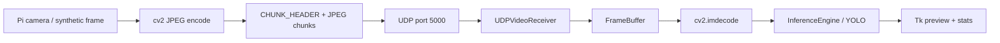

### Audio

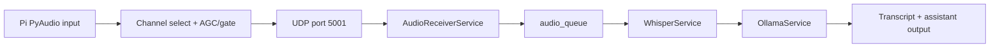

### Speech / Whisper / LLM

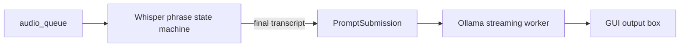

### Configuration and GUI events

```mermaid
flowchart LR
  ENV[pibot.env / env vars] --> CFG[load_settings()]
  CFG --> GUI[OperatorConsoleApp]
  GUI --> RC[RuntimeConfig]
  GUI --> SSH[PiStreamerManager]
  GUI --> SC[StartupChecks]
```

## 9. Threading Model

### Threads / workers

| Thread / task | Owner | Purpose | Synchronization |
|---|---|---|---|
| Tk main thread | `pc/client.py` | GUI event loop and widget updates | Tk event loop; no direct worker UI writes |
| Audio receiver thread | `AudioReceiverService` | Receive UDP audio and enqueue chunks | `stop_event`, queue backpressure |
| Whisper worker thread | `WhisperService` | Segment/transcribe speech | `stop_event`, runtime config lock, queues |
| Ollama worker thread | `OllamaService` | Stream LLM response | `stop_event`, queue |
| Video widget poll timer | `UDPVideoReceiver` | Poll UDP socket and drain UI queue | Tk `after()` |
| Video render worker thread | `UDPVideoReceiver` | Decode/infer/render frames | render queue, inference lock, stop event |
| UI drain timer | `OperatorConsoleApp` | Apply queued UI updates | Tk `after()` |
| Log drain timer | `OperatorConsoleApp` | Append queued logs | Tk `after()` |
| Status refresh timer | `OperatorConsoleApp` | Update CPU/memory/network status | Tk `after()` |
| Startup checks thread | `OperatorConsoleApp` | Validate model/UDP/Ollama | `_post_ui()` |
| Streamer status thread | `OperatorConsoleApp` | SSH query of Pi streamer state | `_post_ui()` |
| Streamer action thread | `OperatorConsoleApp` | SSH start/stop streamer | `_post_ui()` |
| ThreadMonitor monitor thread | `pc/services/thread_monitor.py` | Watch and restart threads | internal lock, stop event |

### Queues

- `audio_queue`: `tuple[np.ndarray, float]`
- `ollama_queue`: `PromptSubmission`
- `log_queue`: formatted strings
- `ui_queue`: `(callback, args, kwargs)`
- `UDPVideoReceiver._render_queue`: `(frame_id, jpeg_bytes)`
- `UDPVideoReceiver._ui_queue`: status/frame events

## 10. State Machines

### Connection state

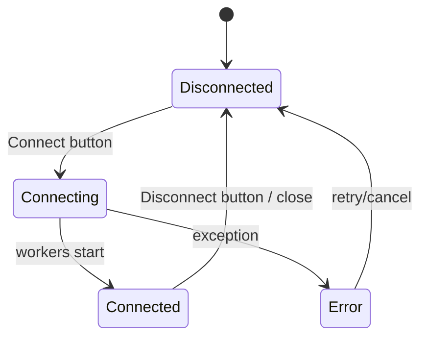

### Whisper phrase state

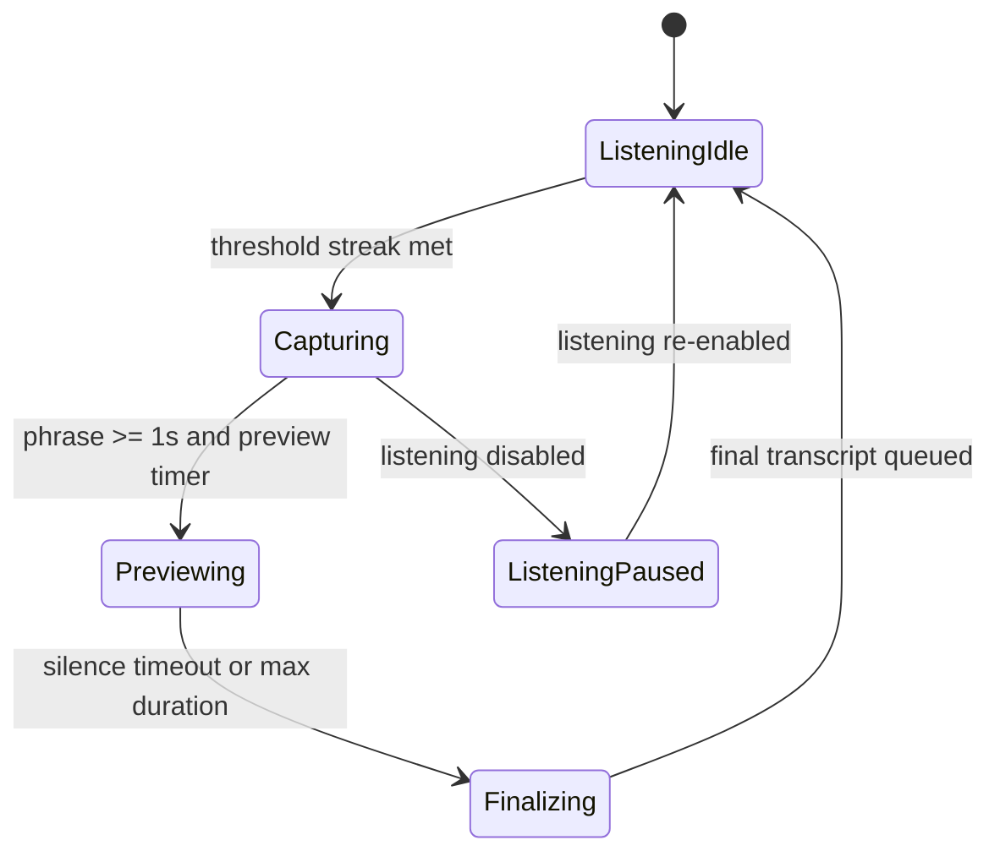

### Video receiver state

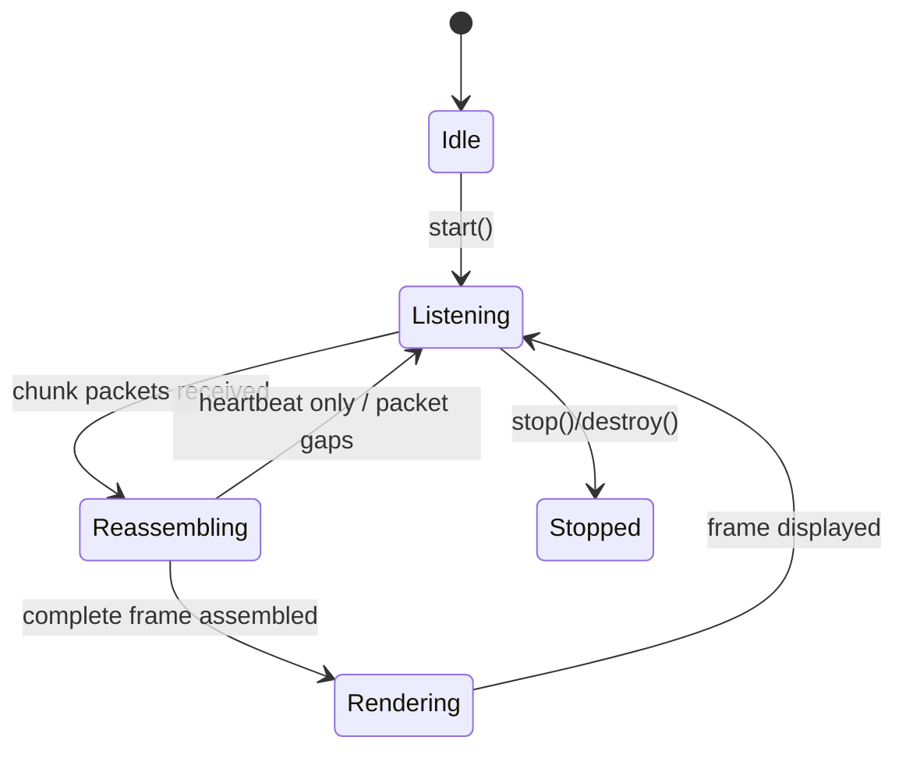

### Inference state

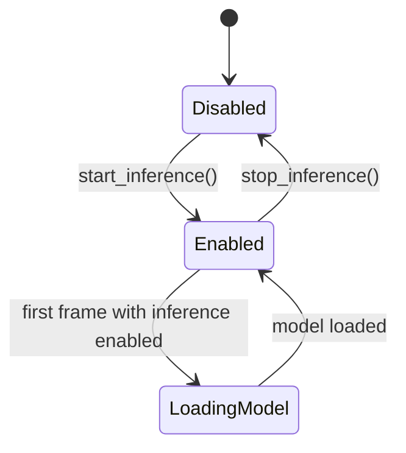

## 11. Configuration

### Environment-backed settings

| Key | Default | Purpose | Runtime use |
|---|---|---|---|
| `PIBOT_CONFIG_FILE` | `pibot.env` | Alternate env-file path. | `load_settings()` |
| `PIBOT_UDP_BIND_HOST` | `0.0.0.0` | Local bind address for PC UDP sockets. | Audio/video receiver bind, startup checks. |
| `PIBOT_PC_HOST` | `192.168.0.189` | PC host identity / Pi destination. | Pi streamer destination, startup alignment check. |
| `PIBOT_UDP_AUDIO_PORT` | `5001` | Audio stream port. | Audio stream and receiver. |
| `PIBOT_UDP_VIDEO_PORT` | `5000` | Video stream port. | Video stream and receiver. |
| `PIBOT_WHISPER_SAMPLE_RATE` | `16000` | Whisper input rate. | Audio queue consumer. |
| `PIBOT_PI_SAMPLE_RATE` | `48000` | Pi capture rate. | Mic streamer and audio processing. |
| `PIBOT_YOLO_MODEL_PATH` | `yolo26m.pt` | YOLO weights file. | Startup model check, inference engine. |
| `PIBOT_OLLAMA_URL` | `http://localhost:11434/api/generate` | Ollama generate endpoint. | Ollama worker and startup check. |
| `PIBOT_OLLAMA_MODEL` | `llama3:instruct` | Ollama model name. | Ollama worker. |
| `PIBOT_PI_HOST` | `192.168.0.38` | Pi SSH host. | Streamer manager SSH target. |
| `PIBOT_PI_USER` | `jorg` | Pi SSH user. | Streamer manager SSH target. |
| `PIBOT_PI_VENV_PATH` | `/home/jorg/venv` | Remote Python executable root. | SSH streamer launch command. |
| `PIBOT_PI_PROJECT_PATH` | `/home/jorg/pibot` | Remote project root. | SSH streamer launch/status and PID files. |

### Runtime-only settings

| Setting | Default | Purpose |
|---|---|---|
| `RuntimeConfig.volume_threshold` | `0.045` | Voice detection threshold. |
| `RuntimeConfig.silence_timeout` | `1.2` | Phrase finalization silence timeout. |
| `RuntimeConfig.audio_stream_enabled` | `True` | Audio buffering enable flag. |
| `RuntimeConfig.listening_enabled` | `True` | Whisper processing enable flag. |

### Pi audio constants

| Key | Default | Purpose |
|---|---|---|
| `INPUT_CHANNELS` | `2` | Capture channels. |
| `OUTPUT_CHANNELS` | `1` | Mono output target. |
| `FORMAT` | `pyaudio.paInt32` | Input sample format. |
| `CHUNK_FRAMES` | `1024` | Frames per audio packet. |
| `INPUT_DEVICE_INDEX` | `None` | Heuristic device selection. |
| `CHANNEL_MODE` | `left` | Mono selection mode. |
| `NOISE_GATE_RMS` | `0.0005` | Silence gate threshold. |
| `TARGET_RMS` | `0.080` | AGC target level. |
| `MIN_GAIN` | `1.0` | Minimum gain. |
| `MAX_GAIN` | `28.0` | Maximum gain. |
| `AGC_ATTACK` | `0.35` | Gain rise rate. |
| `AGC_RELEASE` | `0.15` | Gain fall rate. |

### Pi video constants

| Key | Default | Purpose |
|---|---|---|
| `FRAME_WIDTH` | `640` | Capture width. |
| `FRAME_HEIGHT` | `480` | Capture height. |
| `FPS` | `20` | Target frame rate. |
| `JPEG_QUALITY` | `50` | JPEG compression quality. |

## 12. Network Architecture

| Port / channel | Protocol | Ownership | Direction | Notes |
|---|---|---|---|---|
| UDP 5001 | UDP | PC binds; Pi sends | Pi -> PC | Audio stream to Whisper. |
| UDP 5000 | UDP | PC binds; Pi sends | Pi -> PC | Video chunks and heartbeat. |
| SSH 22 | SSH | Pi SSH daemon | PC -> Pi | Remote streamer management. |
| HTTP 11434 | HTTP | Ollama service | PC -> Ollama | LLM generate API. |

### Packet formats

- **Audio**: `AUDIO_HEADER = !IH` = sequence number (`uint32`) + chunk frame count (`uint16`) + raw PCM (`int16`), mono after processing.
- **Video chunk**: `CHUNK_HEADER = !IHH` = frame id (`uint32`) + total chunks (`uint16`) + chunk index (`uint16`) + JPEG chunk bytes.
- **Heartbeat**: `HEARTBEAT_PACKET = !BQ` = packet type (`uint8`) + timestamp in milliseconds (`uint64`).

### Socket ownership

- `AudioReceiverService` owns the PC UDP audio socket.
- `UDPVideoReceiver` owns the PC UDP video socket.
- `UDPMicStreamer` owns the Pi UDP audio socket.
- `UDPVideoStreamer` owns the Pi UDP video socket.

### Reconnect / heartbeat behavior

- No automatic reconnect exists.
- `UDPVideoStreamer` emits heartbeats every 500 ms.
- GUI network status marks online if connected and heartbeat is recent, or if audio/video packets are both recent.
- Connection recovery is manual via Disconnect/Connect or SSH streamer refresh/start actions.

## 13. Raspberry Pi Software

### Running services

- `pi/mic_udp_streamer.py`
- `pi/video_udp_streamer.py`
- `pi/audio_diagnostics.py` (manual diagnostic tool)

### Hardware interfaces

- Pi microphone via PyAudio
- Pi camera via `picamera2` if installed; otherwise synthetic frames

### Startup scripts

The Pi entrypoints:

- add project root to `sys.path`
- load settings
- create `.run/*.pid`
- start streamer objects
- register `atexit` cleanup

### Streaming behavior

- mic streamer reads `pyaudio` input, applies `select_mono_channel()` and `apply_agc_and_gate()`, then sends UDP audio packets
- video streamer captures frames, JPEG-encodes them, chunks them to fit `MAX_UDP_PAYLOAD = 1200`, and sends heartbeat packets independently

## 14. Error Handling

### Logging

- PC logging goes to stdout and GUI log queue.
- Video receiver and streamer modules log operational diagnostics.
- `audio_receiver` logs packet counts and queue pressure.

### Exceptions and recovery

- `AudioReceiverService.run()` logs bind errors and exits.
- `WhisperService._transcribe()` logs exceptions and returns empty text.
- `OllamaService.run()` logs exceptions and appends `[Ollama error]`.
- `StartupChecks.check_ollama()` treats any exception as unreachable.
- `PiStreamerManager._run_ssh()` returns `None` on timeout or subprocess exceptions.
- `UDPVideoReceiver._render_worker()` converts decode/model failures into status text.

### Retries / automatic recovery

- No automatic network reconnect.
- `ThreadMonitor` can restart threads, but it is not currently integrated.
- Queue overflow is handled by dropping the oldest item and logging a warning.
- Video frame buffers are pruned when incomplete-frame count exceeds the buffer limit.

## 15. External Dependencies

### Python packages from `requirements.txt`

- `numpy`
- `scipy`
- `opencv-python`
- `openai-whisper`
- `torch`
- `ultralytics`
- `requests`
- `Pillow`
- `pyaudio`

### Additional runtime imports

- `picamera2` on Pi, optional
- `cv2`
- `whisper`
- `ultralytics.YOLO`
- `PIL.Image` / `PIL.ImageTk`

### System dependencies noted by the repository

- Python 3.9+
- `tkinter`
- `ffmpeg` for Whisper
- `portaudio19-dev` for PyAudio builds
- camera-enabled Raspberry Pi setup
- network connectivity between Pi and PC

## 16. Sequence Diagrams

### Start Video Stream

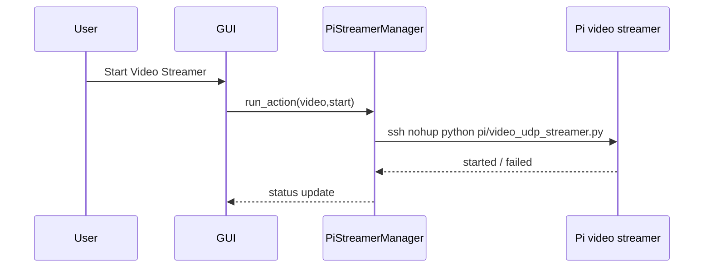

### Stop Video Stream

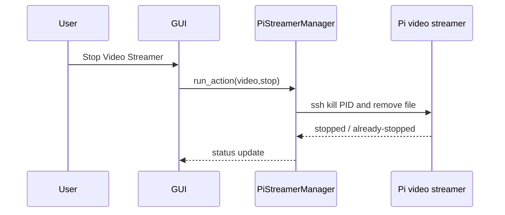

### Start Audio Stream

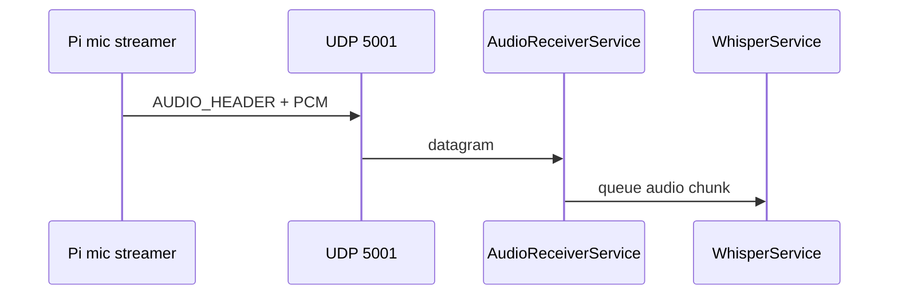

### Stop Audio Stream

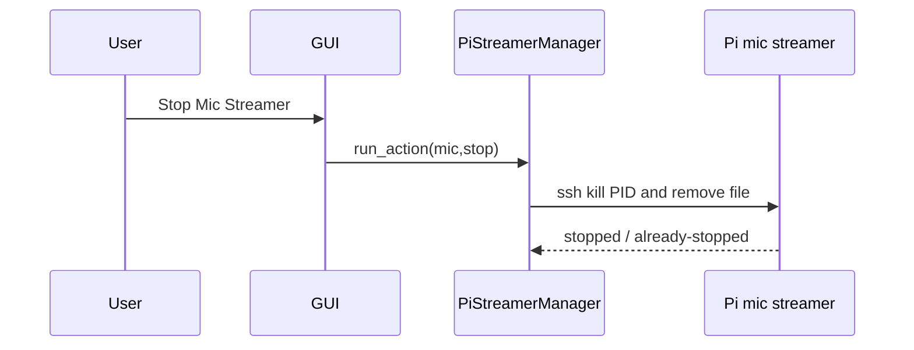

### Speech Recognition

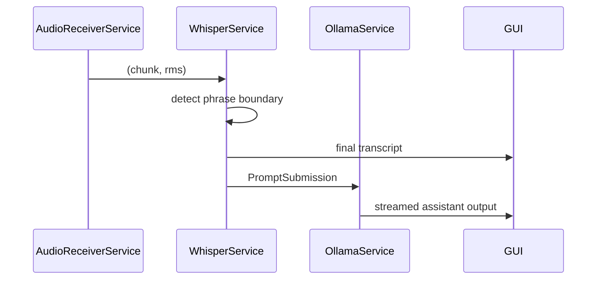

### Ollama Request

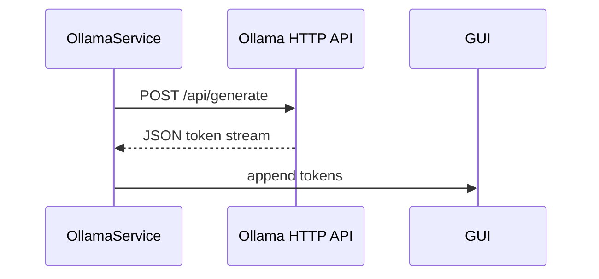

### Inference

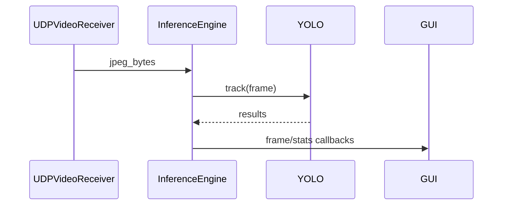

### Startup

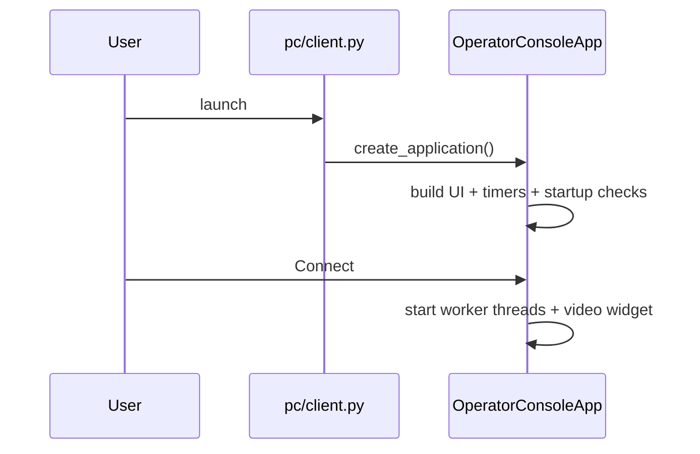

### Shutdown

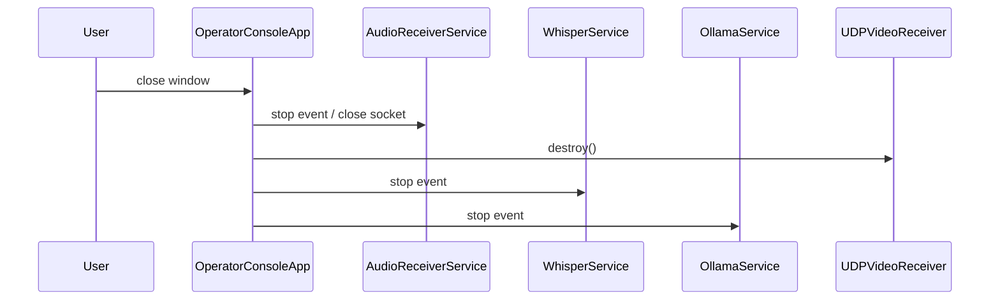

## 17. Component Diagrams

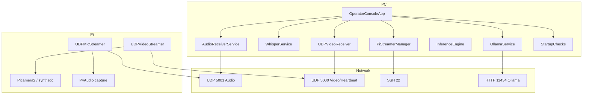

## 18. File Dependency Graph

### Internal module relationships

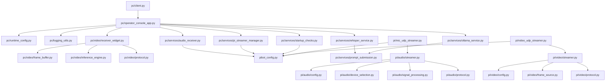

### Observed coupling / circularity

- No Python import cycles are present in the current runtime path.
- `pc/video/receiver_widget.py` and the Pi entrypoints mutate `sys.path` to reach `pibot_config.py`.
- Archived compatibility shims duplicate import paths but are not used by the current GUI.

## 19. Known Technical Debt

- `pc/services/thread_monitor.py` is implemented but not wired into the GUI.
- `OperatorConsoleApp._build_bottom_panel()` duplicates the logs tab and is unused.
- `pc/video/receiver_widget.py` treats the first byte as a heartbeat discriminator, even though chunk packets do not carry an explicit type field.
- `PiStreamerManager` builds SSH commands with string interpolation and assumes path values contain no shell-breaking characters.
- `pc/video/receiver_widget.py` binds the UDP socket during widget construction, so startup can fail immediately if the port is occupied.
- `WhisperService` loads the Whisper base model on first use and can block the worker for several seconds.
- `audio_receiver` resamples with a fixed factor of 3 rather than deriving the ratio from configured rates.
- `pc/video/receiver_widget.py` and archived modules expose the typo alias `UDPVideoReciever`.
- Archived compatibility files and historical audit docs are still present in the repository.

## 20. Interface Verification

Verified call paths and interface traces:

- `pc/client.main()` -> `create_application()` -> `OperatorConsoleApp`
- `OperatorConsoleApp.connect()` -> `AudioReceiverService.start()`
- `OperatorConsoleApp.connect()` -> `WhisperService.start()`
- `OperatorConsoleApp.connect()` -> `OllamaService.start()`
- `OperatorConsoleApp.connect()` -> `_start_video_receiver()` -> `UDPVideoReceiver.start()`
- `PiStreamerManager.run_action()` -> `ssh` -> Pi streamer scripts
- `pi/audio/streamer.UDPMicStreamer.run()` -> `AUDIO_HEADER.pack()` -> UDP send
- `pi/video/streamer.UDPVideoStreamer.run()` -> heartbeat + chunk send
- `UDPVideoReceiver._handle_packet()` -> `FrameBuffer` -> `InferenceEngine.process()`
- `WhisperService._transcribe()` -> `whisper.load_model("base").transcribe()`
- `OllamaService.run()` -> `requests.post(..., stream=True)`
- `StartupChecks.run_all()` -> model/UDP/Ollama/target checks

The document reflects the current code paths above, not the original design notes.
